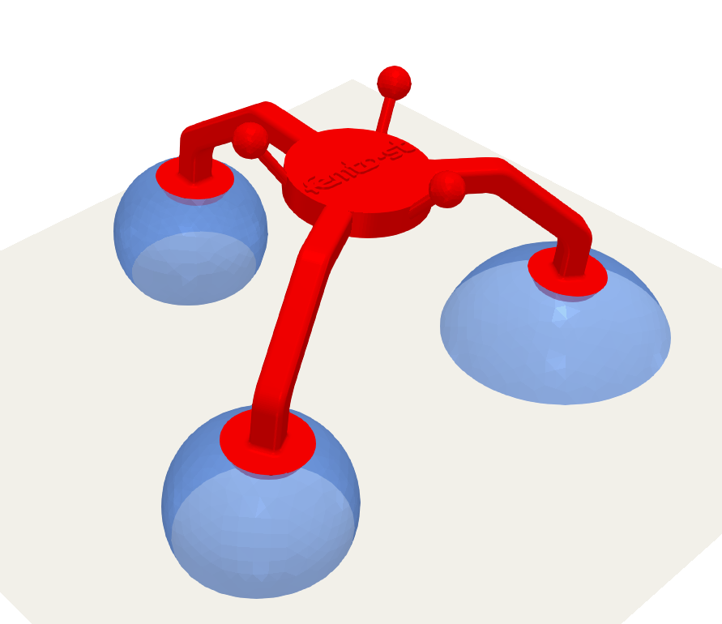

ll<div align="center">
  
</div>


# FluidJ Robot Simulator

The **FluidJ Robot Simulator** is a comprehensive tool designed to analyze both forward and inverse kinematics in microrobots equipped with fluid joints. This repository provides the necessary code and resources to simulate and visualize these operations effectively.

---

## 📂 Folder Structure

The repository is organized as follows:

- **`/temp`**  
  Temporary files used for creating the mesh videos.

- **`/src`**  
  Source code for the simulator.

- **`/data`**  
  - `stl`: Contains the STL file of the end platform.  
  - `/mesh`: Mesh data for the fluid joints.  
  - `vids`: Generated output videos.  
  - `figs`: Generated output figures.

---

## 🚀 Getting Started

To use the FluidJ Robot Simulator, follow these steps:

### 1. Install **Surface Evolver**
Ensure that [Surface Evolver](http://kenbrakke.com/evolver/html/install.htm) is installed on your system. Follow the official installation instructions provided on their website.

### 2. Clone the Repository
In your terminal, run:
```bash
git clone https://github.com/Fran1702/FluidJ-Robot-Simulator
```


### 3. Install Python Dependencies
Navigate to the project folder and install the required Python packages:

```bash
cd FluidJ-Robot-Simulator
python -m pip install -r requirements.txt
```


### 4. Run the Simulator

1. Navigate to the `src` directory:
   ```bash
   cd src

2. Run the forward kinematics simulation example by executing the `main_fk.py` script:
    ```bash
    python main_fkin.py
    ```
3. Once the simulator opens, you will see a 3D view of the robot. You can interact with the simulation using the following commands:
    * `q`: Quit the simulation.
    * `s`: Set new values for the base radii of the fluid joints. After entering the new values, the simulator will compute the forward kinematics and update the 3D view. This may take a few seconds to complete.


## ⚙️ Features

- Analyze **forward kinematics** and **inverse kinematics** for microrobots with fluid joints.
- Generate and visualize simulations of a fluid-joint based microrobot.

---

## 🛠️ Dependencies

Ensure the following are installed on your system:
- **Python 3.8+**
- **Surface Evolver**: [Installation Instructions](http://kenbrakke.com/evolver/html/install.htm)
- Additional Python packages (listed in `requirements.txt`).

---

## 📬 Contact

For questions, issues, or suggestions, feel free to reach out by opening an issue in this repository or contacting me directly.

---

## 📜 License

This repository is licensed under the [MIT License](LICENSE).


